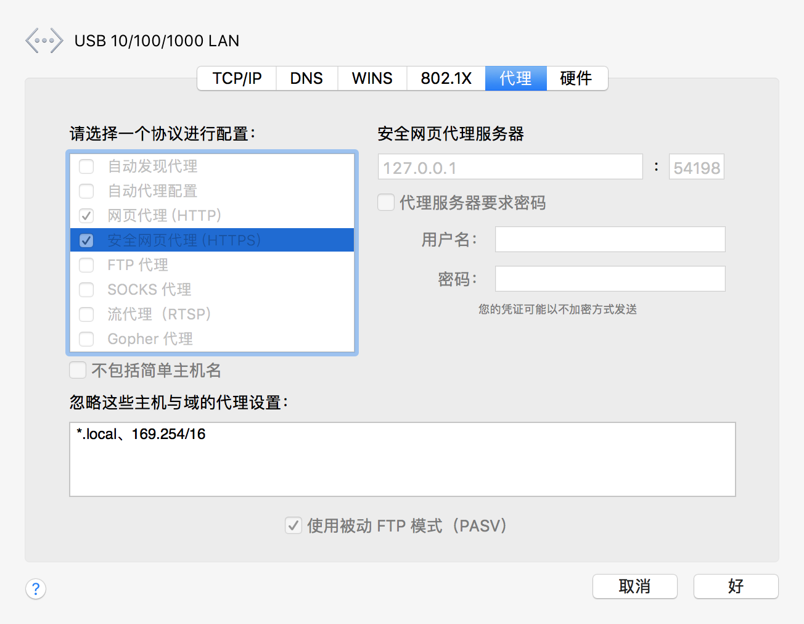
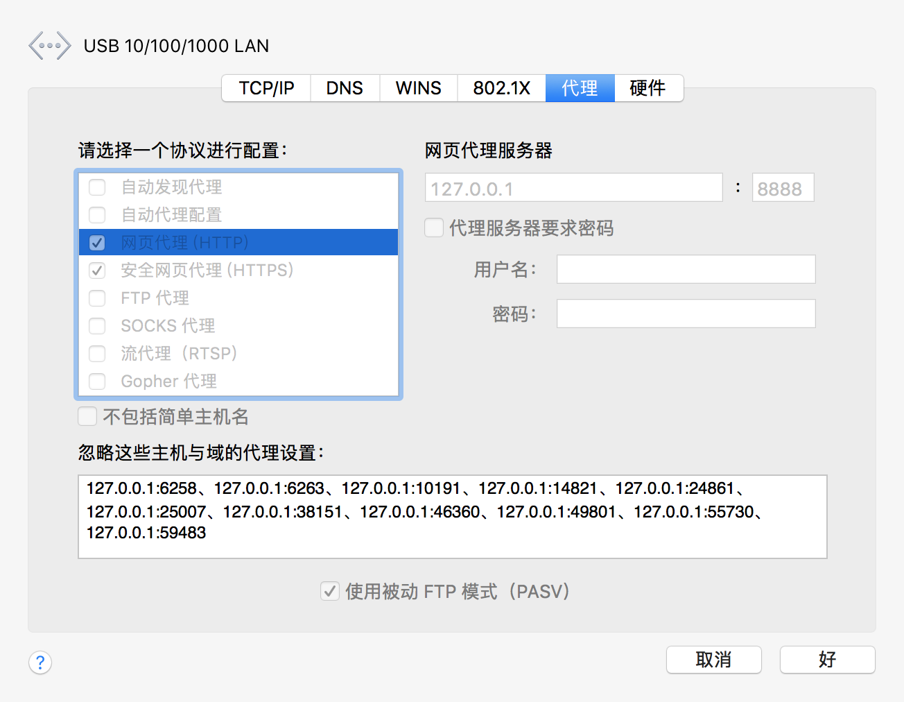

### 外部处理设置
> Charles 的原理是把自己设置成系统的代理服务器，但是在中国，由于工作需要，我们常常需要使用 Google 搜索，所以大部分程序员都有自己的翻墙软件，而这些软件的基本原理，也是把自己设置成系统的代理服务器，来做到透明的翻墙。

> 为了使得两者能够和平共处，我们可以在 Charles 的External Proxy Settings中，设置翻墙的代理端口以及相关信息。同时，我们也要关闭相关翻墙软件的自动设置，使其不主动修改系统代理，避免 Charles 失效。

打开设置 - 网络 - 高级 - 代理 或者 打开蓝灯 - 设置 - 代理 ，来查看代理端口

charles代理前

charles代理后

在charles 中设置外部代理，填写host和port

如果抓取 https 包返回结果不可看时，需要设置 ssl proxying - enable ssl proxying 用于启用指定 IP 和端口的监听，如 *:443代表监听所有 URL 端口为443的 https 请求

### 手机抓包
[手机抓包](https://www.jianshu.com/p/8034b451585b)
[https 错误][02336ff0]

  [02336ff0]: https://www.jianshu.com/p/993ffc7e05fa "Client SSL handshake failed - Remote host closed connection during handshake"

### question
- 打开电脑代理后，无法抓包
    - **除了配置不对，可能本地启动了个8888端口的服务，两者端口冲突导致**
    - 修改`charles`端口
- 手机代理抓包，没反应，手机也无法上网
    - charles获取本地ip有问题，正常应该获取到一个ip，在`help-locaal ip address`中查看
    - 网线换无线试下
    - 网线插头多插拔几次试试
