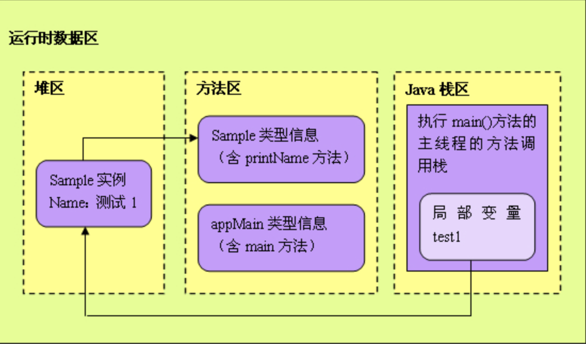

> 相关参考：
> [JVM 内存初学 (堆(heap)、栈(stack)和方法区(method) )][0beacaa3]
> [Java方法区][703d50b0]

```java
AppMain.java
public   class  AppMain//运行时, jvm 把appmain的信息都放入方法区
{
	public   static   void  main(String[] args)  //main 方法本身放入方法区。
	{
		Sample test1 = new  Sample( " 测试1 " );   //test1是引用，所以放到栈区里， Sample是自定义对象应该放到堆里面

		Sample test2 = new  Sample( " 测试2 " );

		test1.printName();
		test2.printName();
	}
}
Sample.java
public   class  Sample//运行时, jvm 把appmain的信息都放入方法区
{
	/** 范例名称 */
	private  name;
	//new Sample实例后， name 引用放入栈区里，  name 对象放入堆里

	/** 构造方法 */
	public  Sample(String name)
	{
		this .name = name;
	}

	/** 输出 */
	public   void  printName()//print方法本身放入 方法区里。
	{
		System.out.println(name);
	}
}
```
导向图：




jvm加载：

1. 执行appMain的main方法
2. 系统收到指令，启动java虚拟机进程
	- 这个进程首先从classpath中找到AppMain.class文件，读取这个文件中的二进制数据，然后把Appmain类的类信息存放到运行时数据区的方法区中。这一过程称为AppMain类的加载过程。
3. Java虚拟机定位到方法区中AppMain类的Main()方法的字节码，开始执行它的指令。

执行main方法：

1. 执行第一条语句：
```java
Sample test1 = new Sample("测试1");
```
	- 创建Sample实例，首先会去方法区中查找Sample对应的类信息等
	- 没有找到对应的类信息
		- 加载了Sample类，把Sample类的类型信息存放在方法区里
	- 找到类信息后，在堆中为一个新的Sample实例分配内存，这个Sample实例持有着指向方法区的Sample类的类型信息的引用(Sample类的类型信息在方法区中的内存地址，存放在Sample实例的数据区里)。
2. test1局部变量，存储在java虚拟机栈中，`=`把test1的变量指向堆中Sample的实例，即test1持有向Sample的引用。
3. 在堆区里继续创建另一个Sample实例，然后依次执行它们的printName()方法。
4. 当JAVA虚拟机执行test1.printName()方法时，JAVA虚拟机根据局部变量test1持有的引用，定位到堆区中的Sample实例，再根据Sample实例持有的引用，定位到方法区中Sample类的类型信息，从而获得printName()方法的字节码，接着执行printName()方法包含的指令。


  [0beacaa3]: http://www.cnblogs.com/dingyingsi/p/3760730.html "JVM 内存初学 (堆(heap)、栈(stack)和方法区(method) )"
  [703d50b0]: http://www.cnblogs.com/wangguoning/p/6109377.html "Java方法区"
