## 语句和语法
Python 语句中有一些基本规则和特殊字符:

    - 井号(#)表示之后的字符为 Python 注释
    - 换行 (\n) 是标准的行分隔符(通常一个语句一行)
    - 反斜线 ( \ ) 继续上一行
    - 分号 ( ; )将两个语句连接在一行中
    - 冒号 ( : ) 将代码块的头和体分开
    - 语句(代码块)用缩进块的方式体现
    - 不同的缩进深度分隔不同的代码块
    - Python文件以模块的形式组织

### 多个语句构成代码组(:):
缩进相同的一组语句构成一个代码块，我们称之代码组。像 if、while、def 和 class 这样 的复合语句，首行以关键字开始，以冒号( : )结束，该行之后的一行或多行代码构成代码组。 我们将首行及后面的代码组称为一个子句(clause)。

### 运算符
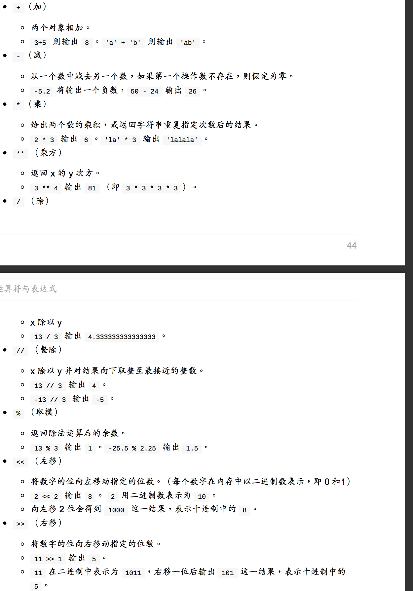

### if
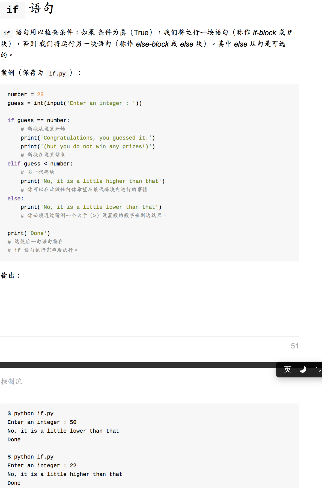

### while
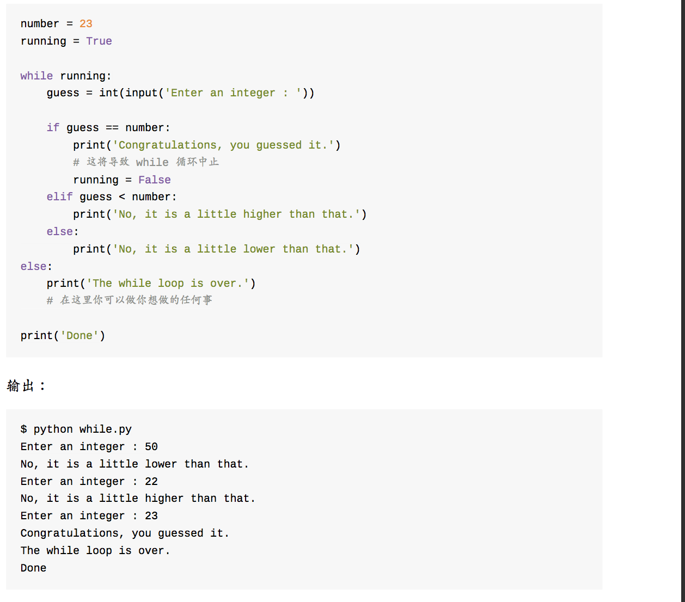

### for
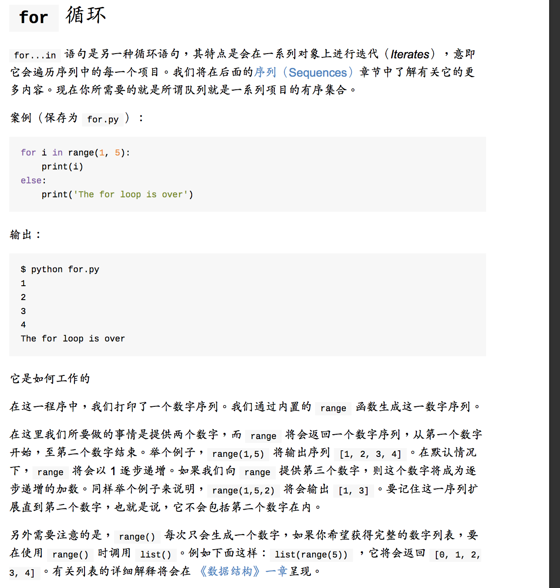

### function
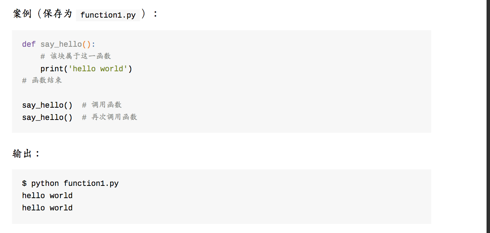

#### function args
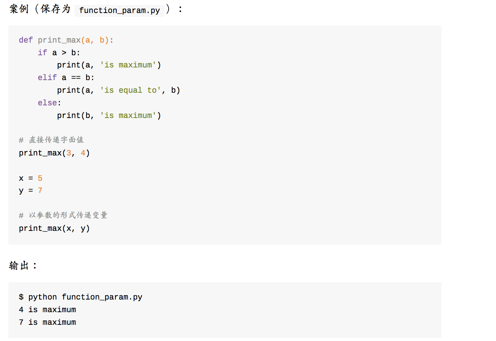

#### function 默认参数
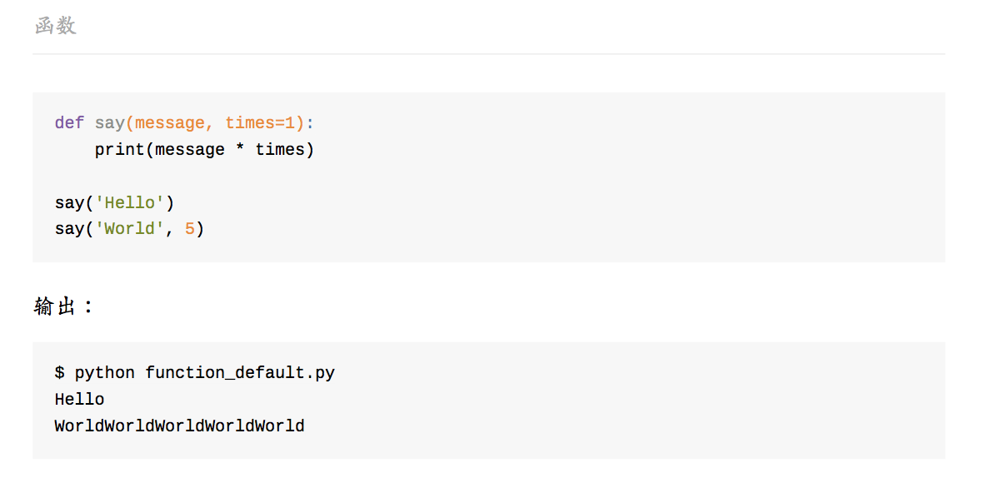

#### function 关键字参数
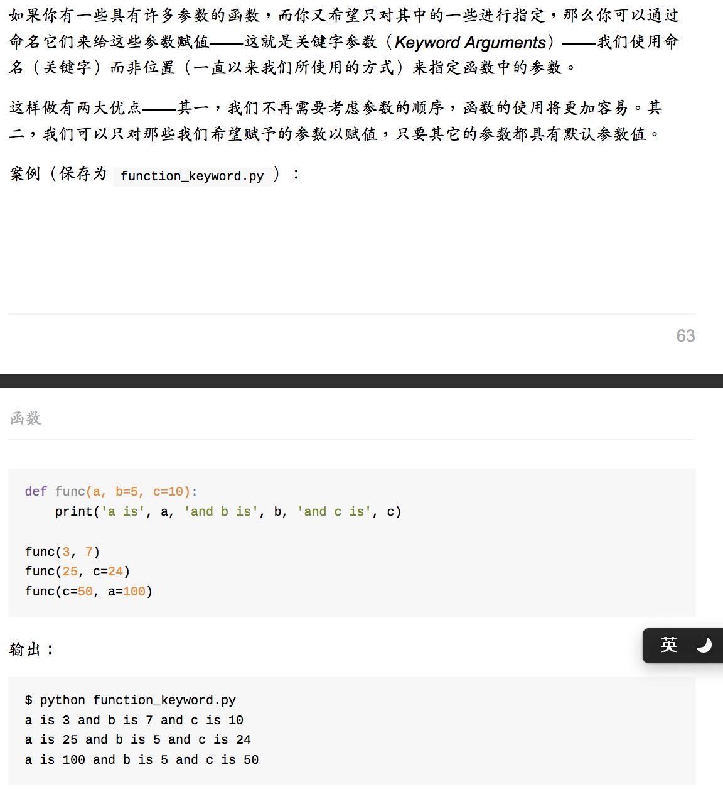

#### function 可变参数
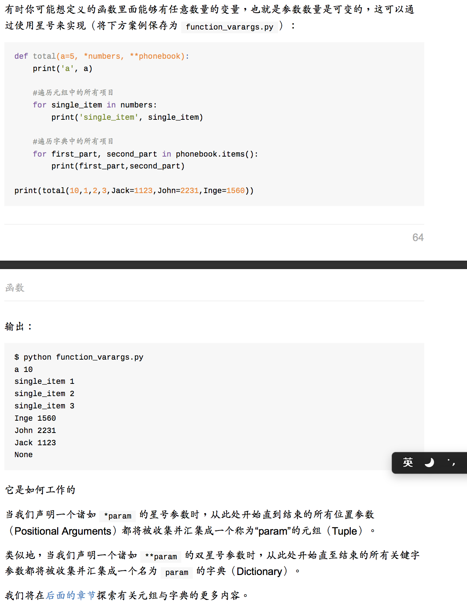

#### function return
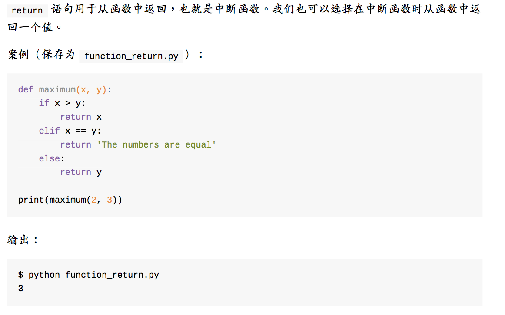

#### function 局部变量
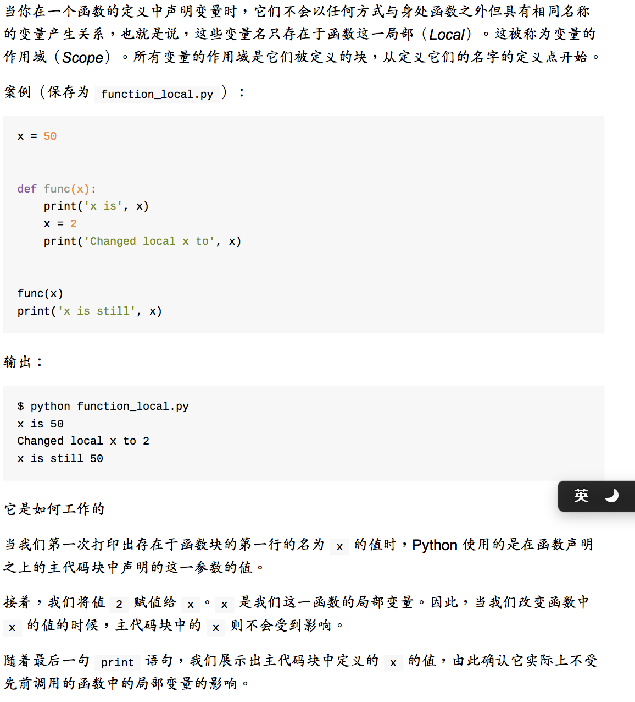

#### function gblobal语句
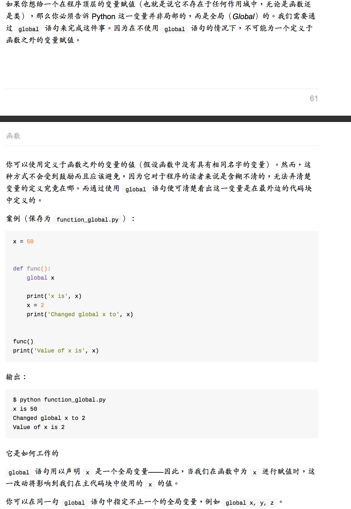

#### function docStrings 文档字符串
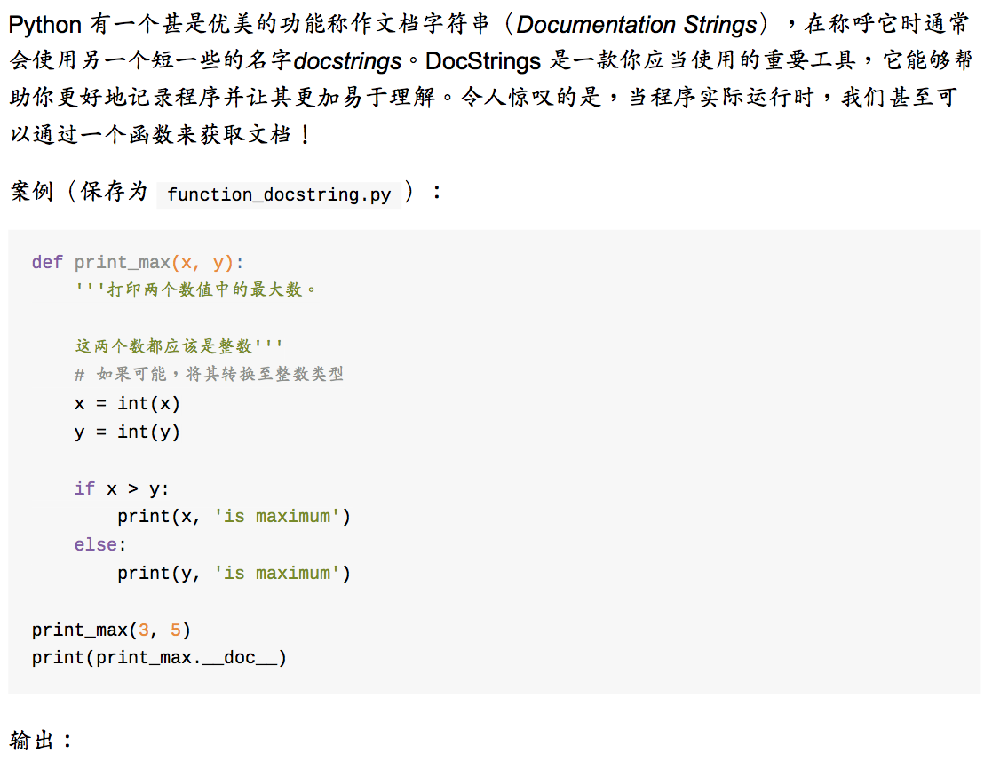
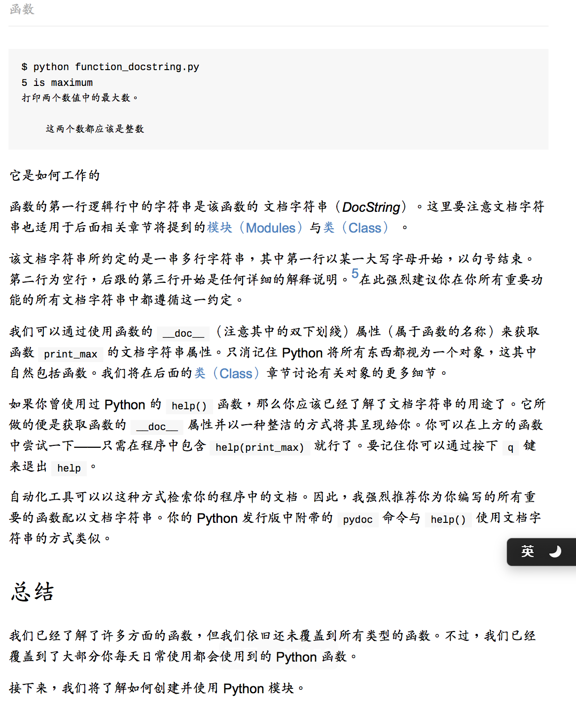
